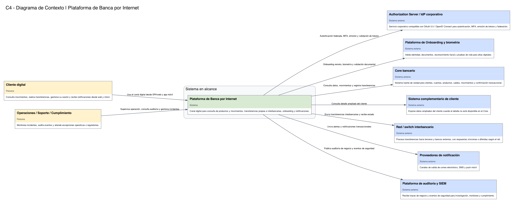
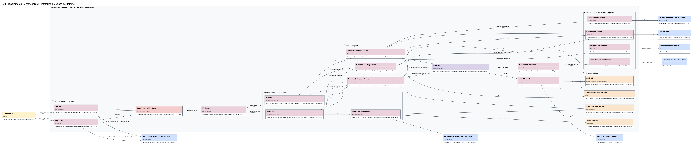
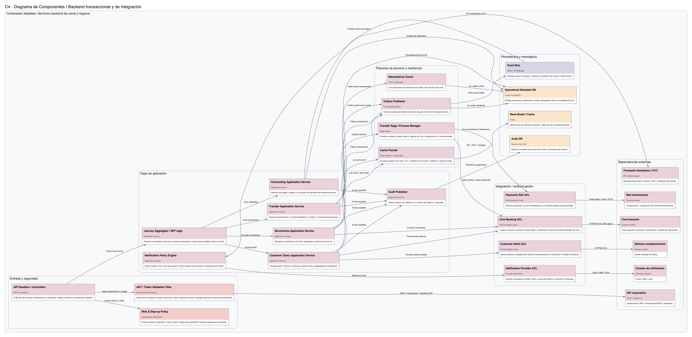

# Solution-Architect-BP

Entrega final del ejercicio de arquitectura empresarial y diseño de solución para plataforma de banca por internet.

## Contenido
- Documento final en PDF: [Arquitectura_Empresarial_Banca_BP.pdf](./Arquitectura_Empresarial_Banca_BP.pdf)
- Diagrama C4 de Contexto: [c4_context.png](./c4_context.png)
- Diagrama C4 de Contenedores: [c4_containers.png](./c4_containers.png)
- Diagrama C4 de Componentes: [c4_components.png](./c4_components.png)

## Vista previa de diagramas
### C4 Contexto

### C4 Contenedores

### C4 Componentes

## Código fuente de diagramas
- [c4_context.py](code/c4_context.py)
- [c4_containers.py](code/c4_containers.py)
- [c4_components.py](code/c4_components.py)
- [common_c4.py](code/common_c4.py)
- [requirements.txt](code/requirements.txt)
